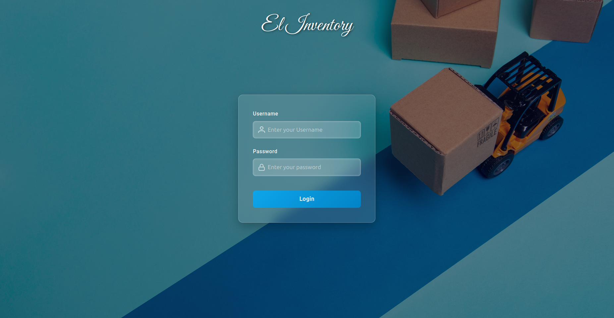
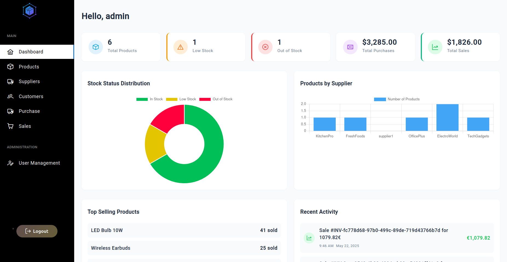
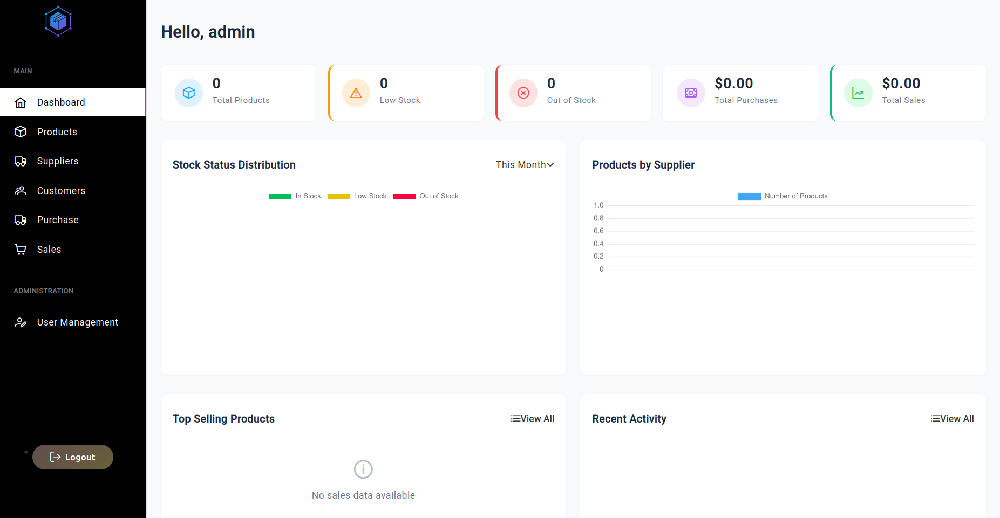
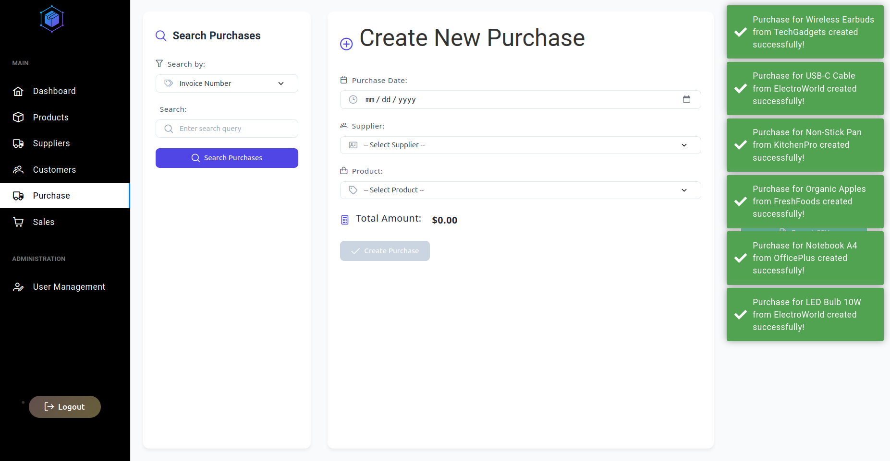

# InventoryManagement

## Overview  
InventoryManagement is a full-stack web application built with **Spring Boot** and **Angular** to help businesses efficiently manage their inventory. It features secure user authentication using **Spring Security** and **JWT**.

---

## Features  
- User registration and login with JWT authentication  
- Role-based access control  
- CRUD operations for inventory items  
- Search and filter inventory products  
- Responsive UI built with Angular  
- RESTful API backend with Spring Boot  

---

## Technology Stack  
| Backend                   | Frontend        | Database           | Build Tools                  |
|---------------------------|-----------------|--------------------|------------------------------|
| Spring Boot, Spring Security, JWT | Angular         | PostgreSQL / MySQL | Maven/Gradle (backend), npm/Angular CLI (frontend) |

---

## Getting Started

### Prerequisites  
- Java JDK 11+  
- Maven or Gradle  
- Node.js & npm  
- Angular CLI  

### Run Backend  
```bash
cd Backend
./mvnw clean install
./mvnw spring-boot:run
```

### Run Frontend  
```bash
cd Frontend
npm install
ng serve
```

---

## Usage  
1. Register or log in to access the inventory dashboard.  
2. Add, update, or delete inventory items.  
3. Search and filter products as needed.

---

## Screenshots

### Login Page  
  

### Dashboard  
  

### Admin Dashboard  
  

### Importing CSV Feature  


---

## Contributing  
Feel free to fork the repository and submit pull requests.  

---

## License  
MIT License
